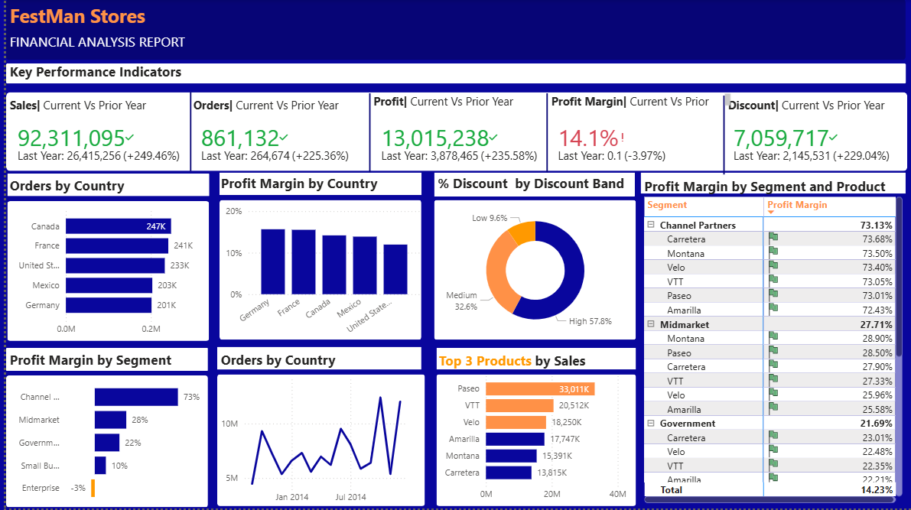

# festman-stores-powerbi-analysis

## Project Overview

This project is a Power BI financial analysis dashboard for **FestMan Stores**. The report analyzes sales performance, profit, profit margin, discounts, products, customer segments, and country-level performance.

The goal of this dashboard is to help business users quickly understand overall financial performance, identify profitable and underperforming areas, and compare current-year results against the previous year.

## Dashboard Preview



## Key Performance Indicators

The dashboard tracks the following business KPIs:

- **Sales Amount**
- **Orders**
- **Profit**
- **Profit Margin**
- **Discount Offered**
- **Current Year vs. Prior Year Performance**

## Dashboard Features

- KPI cards comparing current-year and prior-year performance
- Orders by country
- Profit margin by country
- Discount distribution by discount band
- Profit margin by customer segment
- Monthly sales trend analysis
- Top 3 products by sales
- Product and segment-level profit margin breakdown

## Key Insights

Based on the dashboard:

- Total sales reached approximately **92.31M**, showing strong growth compared to the prior year.
- Total orders reached approximately **861K**, increasing from the previous year.
- Profit reached approximately **13.02M**.
- The overall profit margin was approximately **14.1%**.
- Canada, France, and the United States were among the leading countries by order volume.
- Paseo, VTT, and Velo were among the highest-selling products.
- The Enterprise segment showed negative profitability, which may require further business review.
- High discounts made up the largest share of discount activity, suggesting that discount strategy may have a major impact on profitability.

## Tools Used

- **Power BI** – Dashboard development and visualization
- **Power Query** – Data cleaning and transformation
- **DAX** – KPI calculations and measures
- **Excel** – Source dataset format
- **GitHub** – Project documentation and version control

## Dataset

The project uses a financial sample dataset containing sales, profit, discount, product, segment, country, and date-related fields.

Main dataset file:

```text
Financial Sample (2).xlsx
```

## Power BI Skills Demonstrated

- Data cleaning and preparation
- Data modeling
- DAX measure creation
- KPI development
- Time intelligence analysis
- Year-over-year comparison
- Financial performance analysis
- Interactive dashboard design
- Business intelligence storytelling

## Repository Structure

```text
festman-stores-powerbi-analysis/
│
├── README.md
├── Financial Analysis Report.pbix
│
├── datasets/
│   └── Datasets.zip
│
└── screenshots/
    └── dashboard-overview.png
```

## How to View the Dashboard

1. Download the `.pbix` file from this repository.
2. Open it using **Microsoft Power BI Desktop**.
3. Review the dashboard visuals and interact with the report.

## Business Questions Answered

This dashboard helps answer questions such as:

- How are sales, orders, profit, and discounts performing compared to the previous year?
- Which countries generate the highest order volume?
- Which countries have the strongest profit margins?
- Which products generate the most sales?
- Which customer segments are most and least profitable?
- How does discounting affect business performance?
- What monthly sales trends can be identified?

## Project Summary

This Power BI project demonstrates the ability to turn raw financial data into a clear and interactive business intelligence report. It highlights key financial metrics, identifies performance patterns, and provides insights that can support better decision-making around sales, profitability, products, customer segments, and discount strategy.
